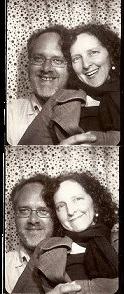
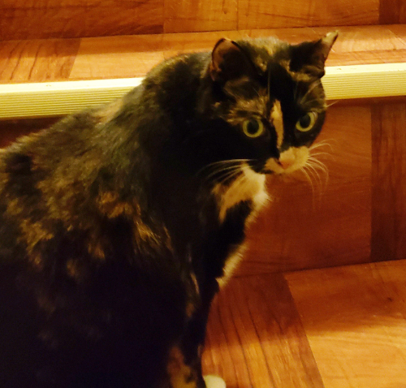
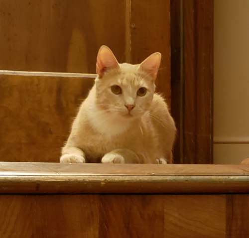

# About

Engineer Scott Anthony and co-proprietor <a href="http://rebeccaturner.net" target="_blank">Rebecca Turner</a> are your hosts at Storybook Sound.

Scott’s 40+ years of audio experience covers both recording and broadcast studios and live venues around the world, working with independent as well as major-label artists. He is a long-time member of the Audio Engineering Society. He’s also an active bass player, in Rebecca’s band as well as with the <a href="https://www.facebook.com/FondFarewellsBand" target="_blank">Fond Farewells</a>. Scott is also a certified yoga instructor. Drop in sometime for his <a href="https://clients.mindbodyonline.com/classic/home?studioid=275360">Kundalini class</a> if you’re in Maplewood, NJ.

Rebecca is a singer-songwriter who’s made three albums at Storybook and is working on a fourth. She also co-hosts the Saturday Afternoon Song Swap performance series with Deena Shoshkes, and they recently celebrated 10 years of swaps. Rebecca is also a copywriter and editor. You can ask her to write stuff for you.

Scott occasionally becomes involved in non-mastering projects… recording, mixing, and producing music. If you’re interested in something like this, let us know.

Upstairs in the house live Bella and Tito, who will be happy to meet you if you're interested. Below you can see what they look like and also check out the Storybook Wall of Instant Fame. For featured news and items of note, <a href="#news">click here</a>.

  

    <figure>
      

        
      

      <figcaption>Bella</figcaption>
    </figure>
  

  

    <figure>
      

        
      

      <figcaption>Tito</figcaption>
    </figure>
  

<link rel="stylesheet" href="styles/gallery.css">
<h2 id="wall-of-instant-fame">Wall of Instant Fame</h2>
<blockquote>Scott took instant photos of almost every visitor to the studio during our first year. While more and more folks send projects to us via the internet, we wanted to show how much we actually do love it when guests stop by. He did forget to pull the camera out a few times, and this instant snapshot project did continue past the first year, right up until we ran outta film in early 2020.<cite>–Rebecca Turner</cite></blockquote>

# News

- Dolby Labs added us to their [Atmos-enabled music studios listing](https://professional.dolby.com/music/dolby-atmos-music-studios){:target="_blank" rel="noopener"}.

- A <a href="https://tapeop.com" target="_blank">TapeOp</a> article by Scott and Rebecca: <a href="https://tapeop.com/interviews/138/david-gilmour/" target="_blank">David Gilmour: The Artist as Producer: Unicorn and Kate Bush</a>.

- An interview with Scott by <a href="https://nugenaudio.com/scott-anthony/" target="_blank">Nugen Audio</a> about using their surround mixing tools for a Richard Thompson documentary.

- <a href="https://www.youtube.com/channel/UCAY0zkFuk2dYSZZ3Qesh94A/featured" target="_blank" rel="noopener">Omniana</a> is a homestream, fundraiser variety show produced at Storybook, featuring many of our dear, talented friends.

- <a href="https://infiniteglitch.net/" target="_blank" rel="noopener">Infinite Glitch</a> – The World’s Longest Pop Song. The original Major Glitch was mixed in 1996 by Scott with Chris Butler, and then featured in the Guinness Book of World Records. The Infinite Glitch is the Major Glitch re-homed from a finite compact disc to the wide-open internet. Musical contributions from Scott are here (recorded and performed 100% by virtual instruments and voices), and <a href="https://infiniteglitch.net/view_artist/Oblique%20Orchestra" target="_blank" rel="noopener">here</a> (a re-imagining of Brian Eno and Peter Schmidt’s <a href="https://en.wikipedia.org/wiki/Oblique_Strategies" target="_blank" rel="noopener">Oblique Strategies</a> as 19 minutes of verses).

- Scott spent much of 2020 <a href="art-design.html" rel="noopener">designing public art</a>. Thank you, George Harrison.

