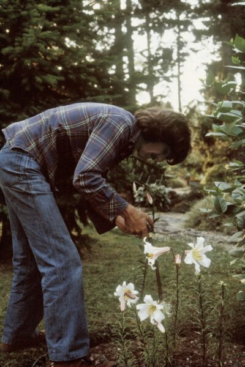
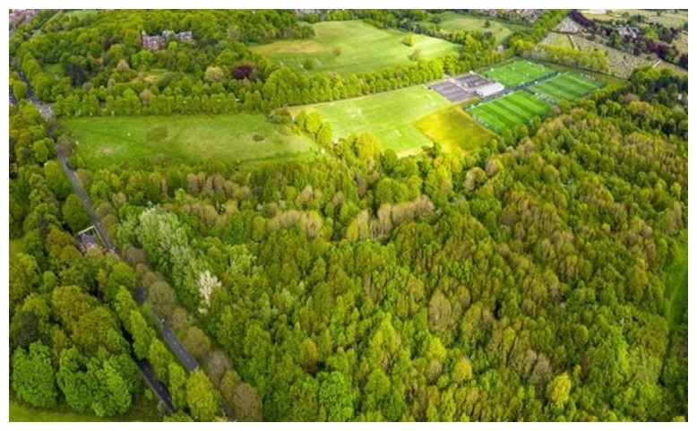

# Art & Design

We’re very honored that Scott Anthony’s public art project “An Experience of Monism based on ‘Within You Without You'” was awarded as a finalist design for the upcoming <u><a href="https://www.thebeatles.com/george-harrison-woodland-walk-be-opened-liverpool" target="_blank" rel="noopener”">George Harrison Woodland Walk</a></u>, a memorial nature preserve being presented by the City of Liverpool and the Estate of George Harrison.

Developed with art project manager Brian Kelly and architect Camilla Flannery (both of whom helped build the Storybook studio as well), this piece ties together Scott’s passions of recording, meditation, and art; designed not just as public art, but also as a meditation center and performance space dedicated to one of his most important musical as well as spiritual influences.

<a href="https://en.wikipedia.org/wiki/Monism" target="_blank" rel="noopener”">Monism</a> is a word for “oneness”, and can be used to describe many things, from a sports team to the sum of a recipe’s ingredients. “<a href="https://en.wikipedia.org/wiki/Within_You_Without_You" target="_blank" rel="noopener”">Within You Without You</a>” is based on the monism of human existence: how experiences of physical, mental, and spirit comprise the entirety of being.

Over the course of his career, Scott’s creative, spiritual, and outdoor pursuits have merged into an artistic language that uses senses of space and simple objects to reveal themes such as the subtleties of human existence, the presence of love, and the fragility of peace.

This project remains under consideration for the future; while they didn’t select it to be built this year, <u><a href="https://www.cultureliverpool.co.uk/" target="_blank" rel="noopener”">Culture Liverpool</a></u> will be adding works to the overall scheme in the coming seasons.&nbsp;We look forward to following this closely, as Liverpool turns to gatherings of spirit as a key component of its recovery.

Please contact us for inquiries — we have a ton of ideas related to the art and design of this and new projects.

<figure>

<figcaption>George Harrison Woodland Walk, Liverpool</figcaption>
</figure>
