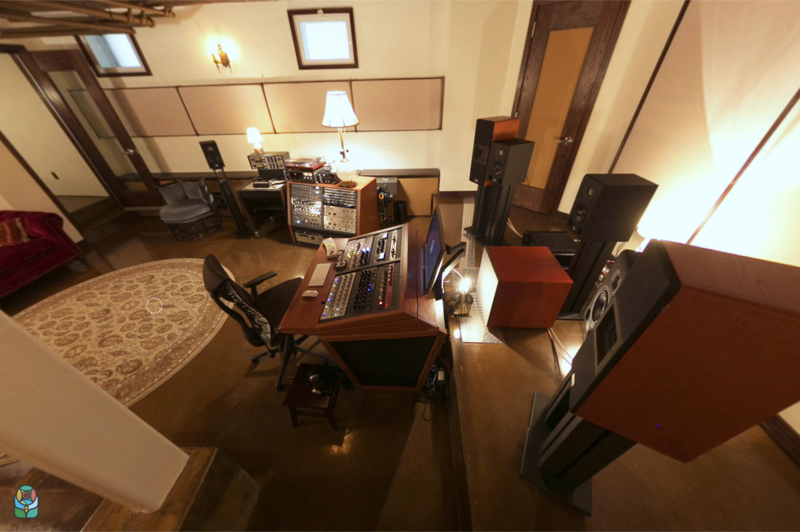
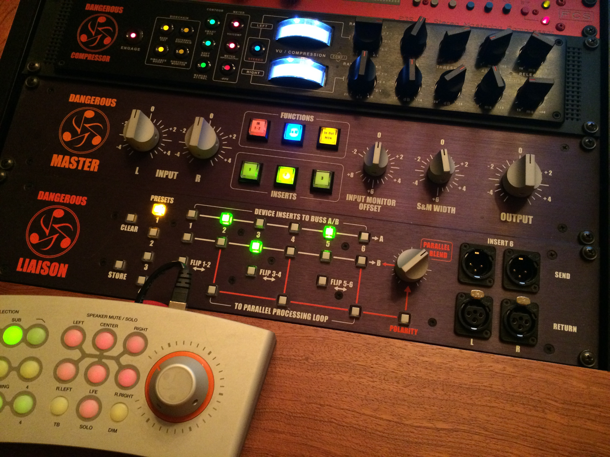

# Studio

<link rel="stylesheet" href="styles/gallery.css">

Storybook was designed by lifetime Grammy recipient <a href="http://www.aes.org/events/141/presenters/?ID=5280" target="_blank">George Augspurger</a>, an audio and acoustical engineer who has been active in studio design for many years, receiving a Technical Grammy Award in 2019 for his amazing work. One of his favorite rooms he has designed is the <a href="http://www.sunsetsound.com/studios/" target="_blank">Studio 1</a> control room at Sunset Sound.

For information about our booking and process, please visit the <a href="booking.html">working with us</a> page. Further down this page you can read about our [services](#services): [mastering](#mastering), [mixing](#mixing), [Dolby Atmos (Spatial)](#dolby-atmos), [recording](#recording) and [producing](#producing).

The [mastering equipment](#equipment) is listed below that, compartmentalized into [monitoring](#monitoring), [processing](#processing), [formats](#formats) and [software](#software).

Recording gear listing gets it's [own page](/recording.html).

## Facilities

Click on the following image to enjoy a [360&deg; virtual tour](/360tour) of the studio.

The following captioned walkthrough tells a little more of the story. We know that historic arched doorway is inviting, but please join us in coming and going via the back door, by the lovely porch and trellis.

## Services

While mastering is our main services and Scott's major area of expertise,
we offer a full range of audio services.

### Mastering

Audio mastering is the first step of manufacturing, and the final creative step of recording. You can master one song, or a whole album. Mastering might adjust the relative loudness of a group of songs, or equalize a song that might be more "boom-y" or more compressed than the others. The timing between tracks and  fade-outs, as well as the names of the songs as they'll appear on the radio or a streaming service, are finalized. We'll then decide on the overall volume of the album for vinyl, CD, or streaming .

Mastering also might require preserving or restoring audio or helping an artist find something different or new to hear. A common consideration in mastering is how the audio might sound when  heard in different environments (car speakers, in a theater, turntable, earbuds, etc.). In any given project, the music itself will dictate the necessary  steps to a complete master, which will be expanded on and refined by our  discussions. Before 2020, we encouraged clients to be present for the session. But attendance was never a requirement! We’ve always done the lion’s share  of our projects corresponding online.

### Dolby Atmos

What's this spatial audio you've been hearing more and more about lately? Apple Spatial and Dolby Atmos take what we know of as surround sound, and expand it to a spherical dimension. They place the listener in the middle of the sound.

It doesn't require large, fancy listening environments and can be achieved through ear pods and headphones. It's brilliant, and an effective way to get your music into some new, popular playlists. We can help you do it!

### Producing, Recording & Mixing

For inspiring people and projects, we offer a Pro Tools foundation, hybridizing a <a href="recording.html">robust collection of analog and digital tools</a> in a cozy, classy environment.

## Mastering Equipment

<figure markdown=1>

  {:width="100%" height="auto"}

  <figcaption style="font-style:italic;margin-top:0.5em;">Any studio is the sum of its parts, including great rooms and an experienced engineer.</figcaption>

</figure>

### Monitoring

- Lipinski Sound L-707 Monitor
- Lipinski Sound L-150 Sub
- Hedd Type 07 and Type 05 Surround Monitors
- Bryston 4B SST Pro
- Lipinski Sound L-400 Alpha Sub-amp
- Dangerous Monitor ST, DAC-ST, and SR
- Grado SR325is

### Processing

- Manley Massive Passive Stereo Mastering EQ
- Manley Stereo Variable Mu Limiter Compressor
- Buzz Audio REQ-2.2 Mastering Resonance Equalizer
- Roger Foote P3S ME Stereo Mastering Compressor
- Dangerous Compressor
- Dangerous BAX EQ
- Pultec EQP-600X x2
- Dangerous Master
- Dangerous Liason
- BAE Audio 1073MPF Line Amps

### Formats

- Ampex AG-440B 1/4″ mastering 2 track (7.5 and 15ips)
- MCI JH-110c 1/2″ and 1/4″ mastering 2 track (7.5, 15 and 30ips)
- TEAC C-3 cassette (fully restored)
- Pro-Ject Xpression Classic turntable w/ Speedbox II, Sumiko Pearl cartridge
- Audio Technica AT-LP120 turntable, Shure M97XE cartridge
- Radial J33 turntable preamp/di

### Software

- Dangerous A.S.S. with DAC
- Mytek Digital Stereo 192-DSD Mastering DAC
- Forssell Technologies MADA-2A AD/DA
- Lavry Blue M-AD 824
- Lavry Blue M-DA 824
- Lavry Black DA10
- SawStudio (mastering software, plug-ins and CD editor)
- Sonoris DDP Creator
- Pro Tools 12 HD with Surround
- RME Fireface 800
- RME Fireface UC
- Panasonic 3700 DAT
- Plextor CD burners with PlexTools

### Recording

Occasionally there are projects which for one reason or another make sense to record here. The gear we have on hand for that is listed on the [recording page](recording).

